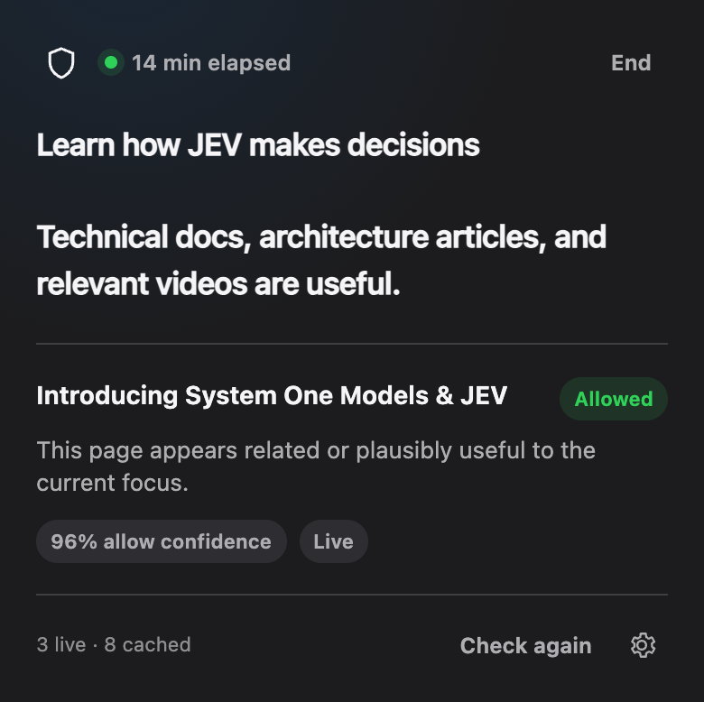

# Focus Guard

Focus Guard is a small Chromium extension that keeps browsing aligned with one focus statement. It asks [JEV, TypeSafe AI's System One decision model](https://typesafe.ai/blog/introducing-system-one-models-and-jev), whether the active page supports that focus and replaces clearly unrelated pages with a block screen.

The repository is named `focus-jev`. The extension itself is called **Focus Guard**.



## Product principles

- One multiline focus statement—no projects, calendars, timers, or account system.
- One typed JEV decision per new destination.
- No “continue anyway” escape hatch during an active session.
- Search and navigation gateways remain available.
- Low-confidence normal pages fail open; open-ended attention feeds use a stricter policy.
- No native app, helper process, local server, accessibility permission, or remote executable code.

## How it works

1. The user enters a focus statement and starts a session.
2. On each active destination, the extension collects the URL, title, page type, and limited public metadata.
3. It asks JEV one direct `noul` question: should this page be blocked because it is clearly outside the complete focus statement?
4. Normal pages block at 65% probability. Open-ended social feeds block at 50% unless the focus explicitly calls for using that feed.
5. The original document is stopped and replaced when blocked, preventing media from continuing behind an overlay.

Decisions are cached by session, normalized URL, and title. Blocks last for the session. Allows expire after one minute so a dynamic page can be reconsidered. Tracking parameters and YouTube playback positions do not create duplicate decisions.

## Install for development

1. Open `brave://extensions` or `chrome://extensions`.
2. Enable **Developer mode**.
3. Choose **Load unpacked**.
4. Select the [`extension`](extension/) directory.
5. Open Settings and add a Cloudflare account ID and narrowly scoped API token that can run `typesafe/jev`. The AI Gateway ID defaults to `jev-local`.

## Privacy

Before a session starts, the extension discloses that the focus statement and each active page's URL, title, and public metadata are sent to Cloudflare for a JEV decision. Credentials and state are stored in the browser profile. The maintainers operate no intermediary service and receive none of this data.

Read the complete [privacy policy](PRIVACY.md) and [security policy](SECURITY.md). Chrome Web Store permission and disclosure copy is maintained in [STORE_LISTING.md](STORE_LISTING.md).

## Development

There are no runtime dependencies and no build step.

```sh
npm run check
npm run package
```

`npm run package` creates a validated store-ready archive in `dist/` with `manifest.json` at the ZIP root.

The test suite covers decision thresholds, gateway behavior, attention feeds, exact-page caching, manual rechecks, background tabs, network fallback, full-page blocking, metadata extraction, polling efficiency, and the HTML/JavaScript UI contract.

The current local runtime baseline and remaining browser profiling plan are documented in [docs/PERFORMANCE.md](docs/PERFORMANCE.md).

## Repository layout

```text
extension/   Manifest V3 extension source
tests/       Dependency-free Node test harnesses
scripts/     Reproducible release packaging
.github/     Continuous integration
```

## Release

The GitHub workflow runs syntax checks and tests, builds the extension ZIP, and uploads it as a workflow artifact. Before a public store submission, follow the checklist in [STORE_LISTING.md](STORE_LISTING.md), publish the privacy policy at a stable URL, and complete a clean-profile browser test.

## License

[MIT](LICENSE)
