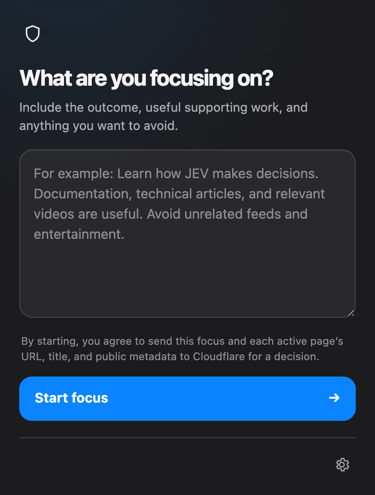

<p align="center">
  
</p>

<h1 align="center">Focus JEV</h1>

<p align="center">
  <a href="https://github.com/davafons/focus-jev/releases/latest"></a>
  <a href="https://github.com/davafons/focus-jev/actions/workflows/ci.yml"></a>
  <a href="https://github.com/davafons/focus-jev/blob/main/LICENSE"></a>
</p>

**Stay with the work in front of you.** Focus JEV is a small Chromium extension that asks [JEV, TypeSafe AI's System One decision model](https://typesafe.ai/blog/introducing-system-one-models-and-jev), whether the active page supports one focus statement. Clearly unrelated pages are replaced with a calm block screen.

No account, timer, project system, native helper, or browsing-history profile. Just one focus statement and a bounded decision for the page you are viewing.

| Start a session | See a decision |
| --- | --- |
|  |  |

## What it does

- Uses one multiline focus statement rather than projects, calendars, or timers.
- Collects a bounded public-page context: URL, title, semantic metadata, structured data, and a short visible-content excerpt.
- Waits briefly for initial content to settle, then asks one typed JEV question for a decision.
- Blocks normal pages at 65% confidence; open-ended attention feeds use a 50% threshold.
- Keeps search and navigation gateways available.
- Allows optional music listening while still evaluating all other destinations by their content.
- Caches decisions by session, normalized URL, title, and bounded page context. Tracking parameters and YouTube playback positions do not create duplicate pages.

## Install for development

1. Open `brave://extensions` or `chrome://extensions`.
2. Enable **Developer mode**.
3. Choose **Load unpacked** and select [`extension`](extension/).
4. Open Settings and choose a provider:
   - **Cloudflare AI** — account ID and narrowly scoped token for `typesafe/jev`.
   - **TypeSafe JEV** — a direct TypeSafe API key.
   - **Compatible System One endpoint** — an endpoint and bearer key using the typed JEV contract.
   - **Focus JEV hosted service** — a small quota-limited allowance through `https://api.focus-jev.lostcoords.com`.

## Privacy

Before a session starts, Focus JEV discloses its data path. Bring-your-own-key modes send the focus statement and limited page metadata directly to the selected provider. Hosted mode relays the same bounded input through the Focus JEV service without retaining page URLs, titles, page metadata, or decisions.

Read the complete [privacy policy](PRIVACY.md), [security policy](SECURITY.md), and [Chrome Web Store disclosure notes](STORE_LISTING.md).

## Development

```sh
npm run check
npm run package
```

`npm run check` runs linting and the dependency-free test suite. `npm run package` creates validated Chrome and Firefox archives in `dist/`, each with `manifest.json` at the ZIP root.

The test suite covers policy thresholds, gateway behavior, dynamic page metadata, caching, manual rechecks, blocked-page display, background tabs, network fallback, and UI contracts. The local runtime baseline is in [docs/PERFORMANCE.md](docs/PERFORMANCE.md).

## Repository layout

```text
extension/   Manifest V3 extension source
worker/      Hosted quota-controlled API
tests/       Dependency-free Node test harnesses
scripts/     Reproducible release packaging
docs/        Product, privacy, and infrastructure material
```

## Release

GitHub CI runs checks, tests, and both package builds on every push and pull request. Pushing a `v*` tag creates a GitHub Release with both ZIPs. Before a public store submission, follow [STORE_LISTING.md](STORE_LISTING.md), publish the privacy policy at a stable URL, and test in a clean browser profile.

## License

[MIT](LICENSE)
